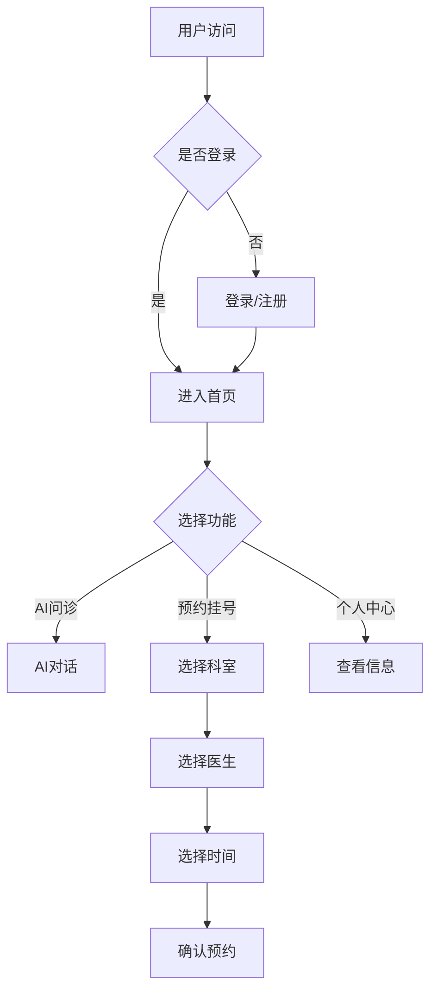

# 智能问诊平台 - 系统实现文档

## 5 系统实现

### 5.1 用户模块实现

#### 5.1.1 系统首页

当进入智能问诊平台系统时，显示的是该系统首页，包含系统公告、最近活动、科室导航等核心功能入口，如图5-1所示。

**功能特点：**
- 展示系统公告列表，支持点击查看详情
- 显示当前用户的最近预约活动记录
- 提供科室快速导航入口
- 集成AI问诊快捷入口

**对应文件：** `front/src/views/Home.vue`

**后端接口：** 
- `GET /notice/list` - 获取公告列表
- `GET /appointment/patient/{userId}` - 获取患者预约记录

---

#### 5.1.2 注册登录

系统提供用户注册和登录功能，支持用户名/手机号登录，如图5-2、5-3所示。

**注册功能：**
- 支持患者、医生、管理员三种角色注册
- 验证用户名、手机号、邮箱格式
- 密码加密存储（BCrypt）

**登录功能：**
- 支持用户名或手机号登录
- JWT token认证机制
- 记住登录状态

**对应文件：** 
- `front/src/views/user/Login.vue`（登录页）
- `front/src/views/user/Register.vue`（注册页）
- `src/main/java/com/backend/controller/AuthController.java`（认证控制器）

**后端接口：**
- `POST /auth/register` - 用户注册
- `POST /auth/login` - 用户登录
- `GET /auth/me` - 获取当前用户信息

---

#### 5.1.3 AI智能问诊

系统提供AI智能问诊功能，患者可以与AI助手进行健康咨询对话，如图5-4所示。

**功能特点：**
- 实时智能对话交互
- 症状描述引导
- 风险等级评估
- 问诊历史记录

**对应文件：** 
- `front/src/views/aiConsultation/chat.vue`（问诊聊天页）
- `front/src/views/aiConsultation/history.vue`（问诊历史页）
- `src/main/java/com/backend/controller/AiConsultationController.java`（AI问诊控制器）

**后端接口：**
- `POST /ai/consult` - AI问诊对话
- `GET /ai/history/{userId}` - 获取问诊历史
- `GET /ai/history/detail/{recordId}` - 获取问诊详情

---

#### 5.1.4 预约挂号

患者可以浏览科室和医生信息，进行在线预约挂号，如图5-5所示。

**功能特点：**
- 科室列表展示
- 医生排班查询
- 预约时间选择
- 预约记录管理

**对应文件：** 
- `front/src/views/Appoint.vue`（预约首页）
- `front/src/views/appoint/Hospital.vue`（医院科室页）
- `front/src/views/appoint/Book.vue`（预约详情页）
- `src/main/java/com/backend/controller/AppointmentsController.java`（预约控制器）

**后端接口：**
- `GET /department/list` - 获取科室列表
- `GET /doctor/list` - 获取医生列表
- `GET /schedule/doctor/{doctorId}` - 获取医生排班
- `POST /appointment/create` - 创建预约

---

#### 5.1.5 通知公告

系统提供通知公告功能，用户可以查看系统发布的公告信息，如图5-6、5-7所示。

**功能特点：**
- 公告列表展示
- 公告详情查看
- 支持分页浏览

**对应文件：** 
- `front/src/views/Home.vue`（公告列表）
- `src/main/java/com/backend/controller/NoticesController.java`（公告控制器）

**后端接口：**
- `GET /notice/list` - 获取公告列表
- `GET /notice/{id}` - 获取公告详情

---

#### 5.1.6 个人中心

用户个人中心页面，展示用户基本信息和功能入口，如图5-8所示。

**功能特点：**
- 用户信息展示
- 功能入口导航
- 快捷操作按钮

**对应文件：** `front/src/views/user/User.vue`

---

#### 5.1.7 我的预约

用户可以查看和管理自己的预约记录，如图5-9所示。

**功能特点：**
- 预约列表展示
- 预约状态筛选
- 取消预约操作

**对应文件：** `front/src/views/appoint/MyJourney.vue`

**后端接口：**
- `GET /appointment/patient/{userId}` - 获取患者预约
- `PUT /appointment/cancel/{id}` - 取消预约

---

#### 5.1.8 就诊记录

用户可以查看自己的就诊历史记录，如图5-10所示。

**功能特点：**
- 就诊记录列表
- 病历详情查看
- 费用信息展示

**对应文件：** `front/src/views/appoint/Visit.vue`

**后端接口：**
- `GET /consultation/patient/{patientId}` - 获取就诊记录

---

#### 5.1.9 账户充值

用户可以进行账户余额充值，如图5-11所示。

**功能特点：**
- 充值金额选择
- 支付方式选择
- 充值记录查看

**对应文件：** `front/src/views/user/Recharge.vue`

**后端接口：**
- `POST /patient/recharge` - 账户充值
- `GET /patient/balance/{patientId}` - 获取余额

---

#### 5.1.10 用户信息

用户可以查看和修改个人信息，如图5-12所示。

**功能特点：**
- 用户信息展示
- 信息修改功能
- 密码修改功能

**对应文件：** `front/src/views/user/UserInfo.vue`

**后端接口：**
- `GET /auth/me` - 获取用户信息
- `PUT /user/update` - 更新用户信息
- `PUT /user/password` - 修改密码

---

### 5.2 医生模块实现

#### 5.2.1 医生工作台

医生登录后进入工作台，查看待处理的预约和就诊记录，如图5-14所示。

**功能特点：**
- 今日预约列表
- 待处理就诊
- 快速接诊入口

**对应文件：** `front/src/views/user/Doctor.vue`

**后端接口：**
- `GET /appointment/doctor/{doctorId}` - 获取医生预约
- `GET /consultation/doctor/{doctorId}` - 获取医生就诊记录

#### 5.2.2 就诊管理

医生可以管理就诊记录，填写诊断结果和处方，如图5-15所示。

**功能特点：**
- 就诊记录列表
- 诊断信息填写
- 处方开具
- 费用结算

**对应文件：** `front/src/views/appoint/Visit.vue`

**后端接口：**
- `POST /consultation/create` - 创建就诊记录
- `PUT /consultation/update` - 更新就诊记录

#### 5.2.3 排班管理

医生可以管理自己的排班信息，如图5-16所示。

**功能特点：**
- 排班列表展示
- 新增排班
- 修改排班
- 删除排班

**对应文件：** `front/src/views/manage/Schedule.vue`（医生端）

**后端接口：**
- `GET /schedule/doctor/{doctorId}` - 获取医生排班
- `POST /schedule/create` - 创建排班
- `PUT /schedule/update` - 更新排班
- `DELETE /schedule/{id}` - 删除排班

---

### 5.3 管理员功能模块实现

#### 5.3.1 系统用户管理

管理员可以管理系统所有用户，包括用户列表、新增、编辑和删除操作，如图5-17所示。

**功能特点：**
- 用户列表展示（支持分页、搜索）
- 用户信息查看
- 用户状态管理
- 用户删除

**对应文件：** `front/src/views/user/Admin.vue`

**后端接口：**
- `GET /user/list` - 获取用户列表
- `POST /user/create` - 创建用户
- `PUT /user/update` - 更新用户
- `DELETE /user/{id}` - 删除用户

#### 5.3.2 科室管理

管理员可以管理医院科室信息，如图5-18所示。

**功能特点：**
- 科室列表展示
- 新增科室
- 编辑科室
- 删除科室

**对应文件：** `front/src/views/manage/Office.vue`

**后端接口：**
- `GET /department/list` - 获取科室列表
- `POST /department/create` - 创建科室
- `PUT /department/update` - 更新科室
- `DELETE /department/{id}` - 删除科室

#### 5.3.3 公告管理

管理员可以发布和管理系统公告，如图5-19所示。

**功能特点：**
- 公告列表展示
- 发布新公告
- 编辑公告
- 删除公告

**对应文件：** `front/src/views/manage/Notice.vue`

**后端接口：**
- `GET /notice/list` - 获取公告列表
- `POST /notice/create` - 创建公告
- `PUT /notice/update` - 更新公告
- `DELETE /notice/{id}` - 删除公告

#### 5.3.4 医生管理

管理员可以管理医生信息，如图5-20所示。

**功能特点：**
- 医生列表展示
- 医生信息编辑
- 医生状态管理

**对应文件：** `front/src/views/user/Admin.vue`（医生管理标签）

**后端接口：**
- `GET /doctor/list` - 获取医生列表
- `POST /doctor/create` - 创建医生
- `PUT /doctor/update` - 更新医生
- `DELETE /doctor/{id}` - 删除医生

#### 5.3.5 预约管理

管理员可以查看和管理所有预约记录，如图5-21所示。

**功能特点：**
- 预约列表展示
- 预约状态管理
- 预约统计

**对应文件：** `front/src/views/manage/`（预约管理页）

**后端接口：**
- `GET /appointment/list` - 获取所有预约
- `PUT /appointment/status/{id}` - 更新预约状态

#### 5.3.6 排班管理

管理员可以管理医生排班信息，如图5-22所示。

**功能特点：**
- 排班列表展示
- 批量排班设置
- 排班统计

**对应文件：** `front/src/views/manage/Schedule.vue`

**后端接口：**
- `GET /schedule/list` - 获取所有排班
- `POST /schedule/batch` - 批量创建排班

---

## 6 技术实现细节

### 6.1 前端技术栈

| 技术 | 版本 | 说明 |
|------|------|------|
| Vue | 3.x | 前端框架 |
| Vite | 5.x | 构建工具 |
| Element Plus | 2.x | UI组件库 |
| Axios | 1.x | HTTP客户端 |
| Vue Router | 4.x | 路由管理 |

### 6.2 后端技术栈

| 技术 | 版本 | 说明 |
|------|------|------|
| Spring Boot | 3.5.x | 后端框架 |
| MyBatis Flex | 1.11.x | ORM框架 |
| MySQL | 8.0.x | 数据库 |
| JWT | 0.12.x | 认证机制 |
| Hutool | 5.x | 工具类库 |

### 6.3 核心业务流程图

---

## 7 代码安全性

### 7.1 注意事项

1. **密码安全**：用户密码使用BCrypt加密存储，禁止明文存储
2. **JWT安全**：Token设置过期时间，支持刷新机制
3. **输入验证**：前后端双重验证，防止SQL注入和XSS攻击
4. **权限控制**：基于角色的访问控制（RBAC）
5. **敏感数据保护**：身份证号、手机号等敏感信息脱敏处理

### 7.2 解决方案

| 安全问题 | 解决方案 |
|----------|----------|
| 密码泄露 | BCrypt加密存储，验证时使用BCrypt.checkpw() |
| 未授权访问 | JWT Token验证，拦截器检查登录状态 |
| SQL注入 | 使用MyBatis Flex参数化查询 |
| XSS攻击 | Element Plus组件自动转义，后端参数过滤 |
| CSRF攻击 | JWT Token放在请求头，不使用Cookie |
